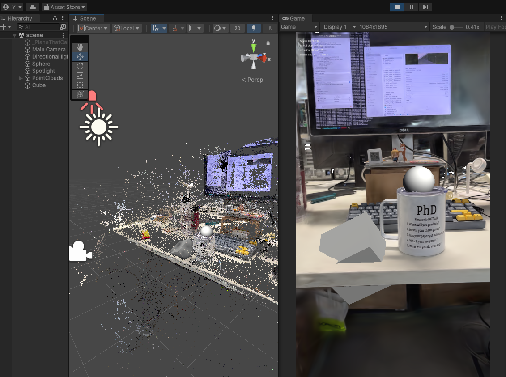
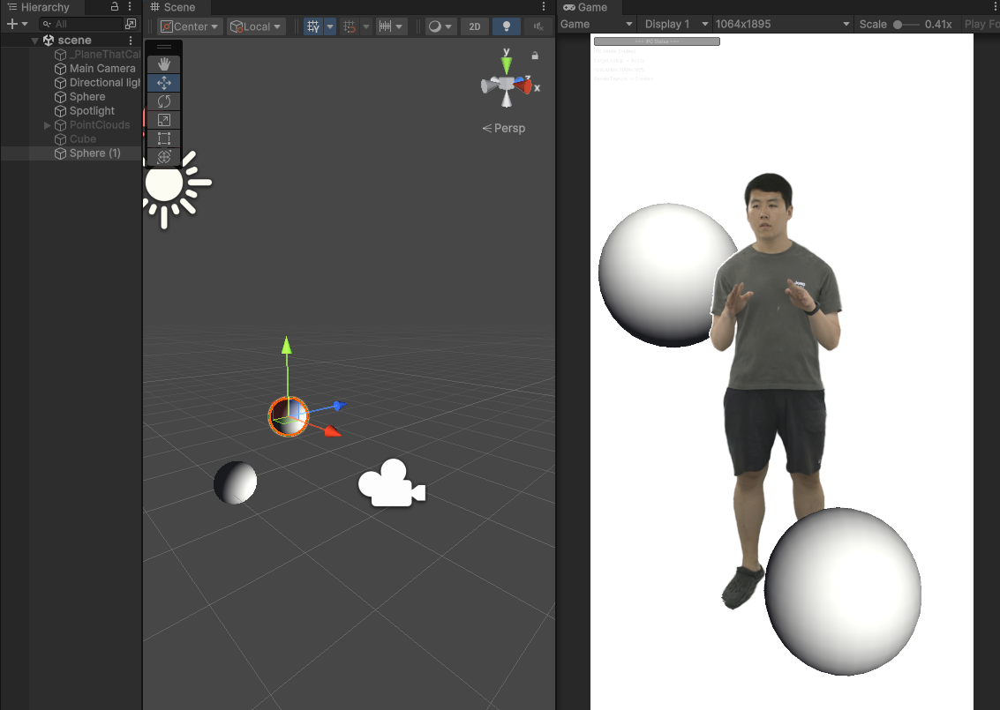

# 🚌 SplatBus

### [Paper](https://arxiv.org/abs/2601.15431)

A Gaussian Splatting viewer framework via GPU interprocess communication for real-time rendering in external applications (e.g., Unity, Blender).

## Screenshots
<div align="center">
  
  <br/>
  <em>Unity plugin visualizing real-time 3D Gaussian Splatting results with interactive point clouds and 3D meshes.</em>
</div>
<br/>
<div align="center">
  
  <br/>
  <em>Unity plugin visualizing real-time Gaussian avatar with 3D meshes.</em>
</div>

## Overview

`SplatBus` is a viewer framework that enables zero-copy GPU memory sharing between Python-based Gaussian Splatting renderers and external viewer applications. By leveraging CUDA IPC (Inter-Process Communication) handles, SplatBus shares GPU memory directly across processes, eliminating expensive CPU-GPU data transfers and enabling real-time interactive visualization.

### Architecture

```
┌─────────────────────────────────────┐     ┌─────────────────────────────────────┐
│         Python Renderer             │     │         Viewer (Unity/etc)          │
│  (3DGS, 4DGS, GaussianAvatar...)    │     │                                     │
│                                     │     │                                     │
│  ┌─────────────────────────────┐    │     │    ┌─────────────────────────┐      │
│  │   GaussianSplattingIPC      │    │     │    │   Viewer Application    │      │
│  │       Renderer              │    │     │    │                         │      │
│  └──────────┬──────────────────┘    │     │    └───────────┬─────────────┘      │
│             │                       │     │                │                    │
│  ┌──────────▼──────────────────┐    │     │    ┌───────────▼─────────────┐      │
│  │  SharedBuffer (Color)    │◄───┼─────┼────┤  CUDA IPC Memory Map    │      │
│  │  SharedBuffer (Depth)    │    │ GPU │    │  (Zero-copy access)     │      │
│  └──────────┬──────────────────┘    │ MEM │    └───────────▲─────────────┘      │
│             │                       │     │                │                    │
│  ┌──────────▼──────────────────┐    │     │    ┌───────────┴─────────────┐      │
│  │   IPCSocketServer (:6001)   │────┼─────┼───►│  Receives IPC handles   │      │
│  │   (sends CUDA handles)      │    │ TCP │    │  & buffer metadata      │      │
│  └─────────────────────────────┘    │     │    └─────────────────────────┘      │
│                                     │     │                                     │
│  ┌─────────────────────────────┐    │     │    ┌─────────────────────────┐      │
│  │  MessageSocketServer (:6000)│◄───┼─────┼────┤  Sends camera pose &    │      │
│  │  (receives poses)           │    │ TCP │    │  point cloud transforms │      │
│  └─────────────────────────────┘    │     │    └─────────────────────────┘      │
└─────────────────────────────────────┘     └─────────────────────────────────────┘
```

## Features

- **Zero-Copy GPU Memory Sharing**: Direct CUDA memory sharing via IPC handles without CPU involvement
- **Dual Buffer Architecture**: Separate color (RGBA32F) and depth (R32F) buffers for flexible rendering pipelines
- **Bidirectional Communication**: Real-time camera pose and point cloud transform updates between renderer and viewer
- **CUDA Event Synchronization**: Proper read/write synchronization across processes via CUDA events
- **Easy Integration**: Simple API designed for seamless integration with existing Gaussian Splatting codebases

## Requirements

- PyTorch >= 2.0.0 with CUDA support
- CUDA-capable GPU (the same GPU must be accessible by both renderer and viewer processes)
- Linux (CUDA IPC is supported on Linux only)
- Windows (Under development; stay tuned.)

## Installation

```bash
# From source
cd splatbus
pip install -e .

# Or directly
pip install .
```

### Renderer (server)

See [**instructions**](https://github.com/RockyXu66/splatbus/tree/main/examples) to run SplatBus with various Gaussian Splatting examples (3D/4D/Avatar).

### Viewer (client)

See [**instructions**](https://github.com/RockyXu66/splatbus/tree/main/clients/Unity-client) to run Unity viewer.

Blender viewer and OpenGL viewer coming soon...

## Project Structure

```
splatbus/
├── splatbus/                   # Python package (renderer side)
│   ├── splatbus/               # Core library
│   │   ├── core/               
│   │   └── renderer.py         # GaussianSplattingIPCRenderer
│   └── examples/               # Python test scripts
├── clients/                    # Viewer implementations
│   ├── Unity-client/           # Unity viewer plugin
│   ├── Blender-client/         # Blender viewer addon
│   └── OpenGL-client/          # OpenGL viewer
└── examples/                   # Integration examples (diff files)
    ├── 3DGS.diff
    ├── 4DGS.diff
    └── GaussianAvatar.diff
```

## Examples

### Running the Test Scripts

```bash
# Terminal 1: Start the Python renderer (simulates Gaussian Splatting rendering)
python splatbus/examples/server_test.py

# Terminal 2: Start the Python simulated viewer (save the images on the disk)
python splatbus/examples/client_test.py
```

Viewer options (Python test script):

```bash
python splatbus/examples/client_test.py \
    --host 127.0.0.1 \
    --ipc-port 6001 \
    --msg-port 6000 \
    --interval 0.1
```

### Integration Examples

The `examples/` directory contains diff files demonstrating how to integrate SplatBus with various Gaussian Splatting implementations:

- `3DGS.diff` - Integration with [3D Gaussian Splatting](https://github.com/graphdeco-inria/gaussian-splatting)
- `4DGS.diff` - Integration with [4D Gaussian Splatting](https://github.com/hustvl/4DGaussians)
- `GaussianAvatar.diff` - Integration with [mmlphuman](https://github.com/1231234zhan/mmlphuman)

## API Reference

**GaussianSplattingIPCRenderer Methods:**

- `update_frame(color_data, depth_data, inverse_depth=True)` - Update shared GPU buffers with new rendered frame
- `update_view(view)` - Update camera view from pose received from viewer
- `update_gaussians(gaussians)` - Update Gaussian positions from transform received from viewer
- `close()` - Release resources and close connections

## License

MIT License - see [LICENSE](splatbus/LICENSE) for details.

## Citation

If you find SplatBus useful for your research and applications, please cite using this BibTeX:

```bibtex
@misc{xu2026splatbusgaussiansplattingviewer,
      title={SplatBus: A Gaussian Splatting Viewer Framework via GPU Interprocess Communication}, 
      author={Yinghan Xu and Théo Morales and John Dingliana},
      year={2026},
      eprint={2601.15431},
      archivePrefix={arXiv},
      primaryClass={cs.GR},
      url={https://arxiv.org/abs/2601.15431}, 
}
```
